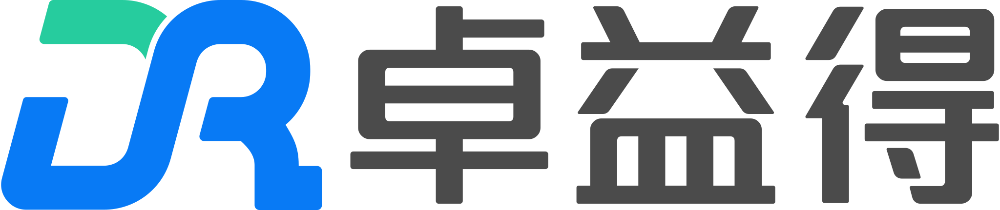

Shanghai DroidUp Co., Ltd. was formerly Shenzhen Xingzhe Robotics Technology Co., Ltd. and was established in 2016. The company offers intelligent robot solutions tailored to scenarios including scientific research and education, interactive services, and home - based health and care. It is dedicated to creating "the safest and most practical humanoid robots".

<table><tbody>

    
    Open source projects 

